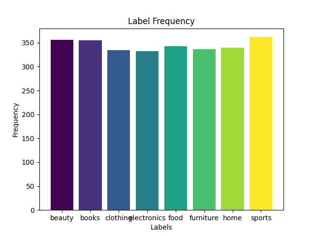

# Decision Tree Classifier

### Task 1

#### Dataset Exploration

Draw a graph that shows the distribution of the various labels across the entire dataset.

### Task 2

#### Multi-Label Classification

1. Build a Decision Tree Classifier Class with the Powerset Formulation which can be initialized by the following set of hyperparameters = ["max depth", "max features", "criterion"]

2. Build a Decision Tree Classifier Class with the MultiOutput Formulation which can be initialized by the following set of hyperparameters = ["max depth", "max features", "criterion"]

For this you are allowed to use the inbuilt sklearn decision tree. Note you are expected to follow the standard datascience practices where you sequentially do

1. data visualization and exploration
2. data preprocessing
3. data featurization
4. train val test splitting

<u>Powerset Formulation</u>

Top 3 hyperparameters (according to F1 score (macro)):

- {'criterion': 'gini',
  'max_depth': 10,
  'max_features': 7,
  'f1': 0.015467398083807985},
- {'criterion': 'gini',
  'max_depth': 30,
  'max_features': 7,
  'f1': 0.011021331609566904},
- {'criterion': 'gini',
  'max_depth': 10,
  'max_features': 9,
  'f1': 0.010721308971495121}

<u>Multi-output Formulation</u>
